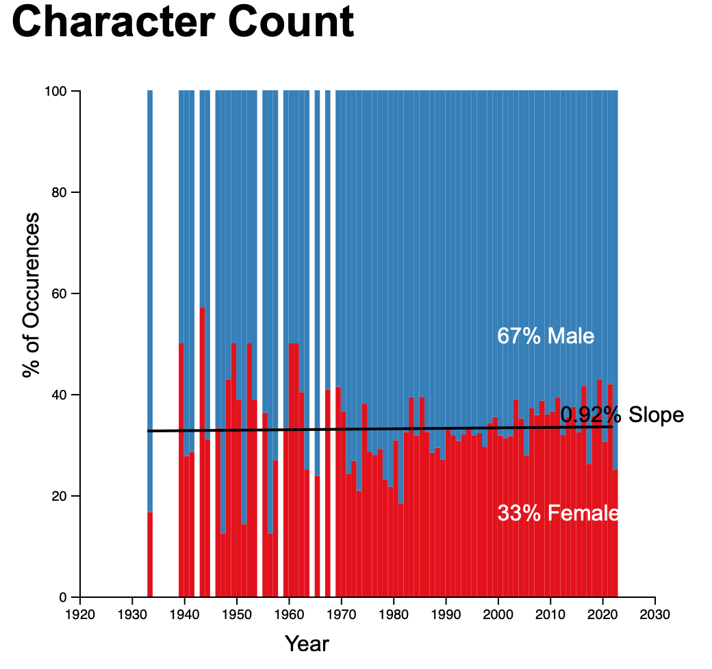

#  Analysing Gender Differences in Movie Scripts

This project, conducted as part of a Data Management and Data Visualisations class assignment, aims to analyse and visualise the differences in gender representation of characters in movie scripts. The key finding is that male characters are twice as prominent as female characters in the analysed 1210 movies between 1920 and 2022, based on character count, name occurrence in script, and spoken word count.

Interactive visualisations are available here: 
- [Character Count](https://djon.info/Data_Management_And_Visualisation_Assignment/Graphs/index_charector_count.html)
- [Character Occurrences Count](https://djon.info/Data_Management_And_Visualisation_Assignment/Graphs/index_charector_occurrence.html)
- [Character Word Count](https://djon.info/Data_Management_And_Visualisation_Assignment/Graphs/index_charector_word_count.html)

## Process

The project followed a rigorous process involving data acquisition, preprocessing, analysis, and visualisation:

1. **Data Acquisition**: Web scraping of movie scripts on the Internet Movie Script Database (IMSDB) was performed using BeautifulSoup.
    
2. **Data Preprocessing**: This involved several steps:
    
    - Extracting character names from the scripts. The scripts are in HTML format, with character names found within `<b>` tags and as the first word followed by a `:`.
    - Splitting words for word counts.
    - Determining character genders using the Gender API.
    - Removing records where the year is missing and characters where gender cannot be determined. This resulted in 25% of characters having an undetermined gender and 686 movies having an associated year.
    - Loading the final data into pandas data frames for analysis and visualisation.
1. **Data Analysis**: The analysis revealed less availability of movies between 1920-1970 with an average of 3 movies per year. The variance of male to female character prominence is quite varying during this period. However, there is a general upward trend for the prominence of female character trends.
    
4. **Data Visualisation**: Visualisations were created using D3.js to represent the findings in an appealing manner. Interactivity was incorporated to show labels and avoid overcrowding the visualisation.
    
## Technologies and Tools Used

The project utilised several technologies and tools:

- **BeautifulSoup**: For web scraping movie scripts from IMSDB.
- **Pandas**: For data manipulation and analysis.
- **Gender API**: For determining the gender of character names.
- **D3.js**: For creating interactive visualisations.
